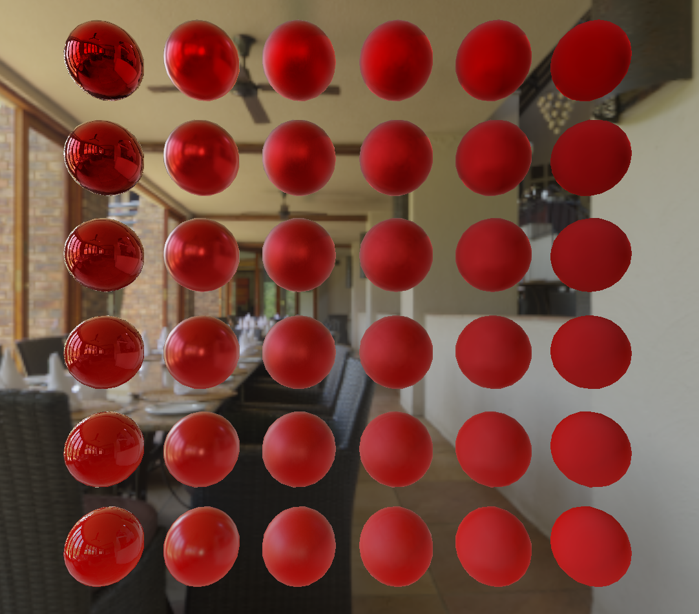

# 3D Vulkan Renderer
A real-time physically based renderer using C++ and Vulkan.

## Screenshots

## Features
* Physically based rendering
* Image based lighting
* Directional and point lights
* Textures
* Skyboxes: cubemaps and hrdi
